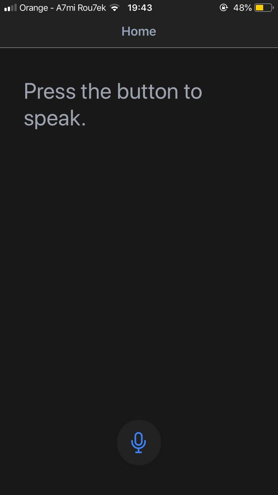
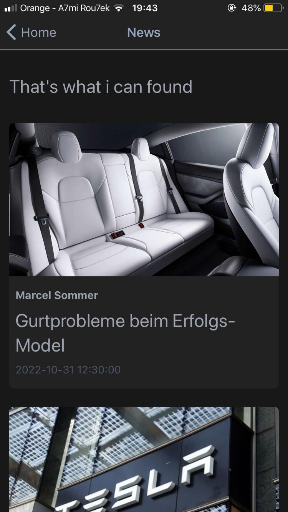

# UpTeller

## About

### This is the images from the demo

	
	
	

### Description

When you open the app you will notice the microphone icon in the bottom of the screen, 
when you press it the application takes the instructions that you submitted through your 
voice and translates it into the information you are looking for to your screeb as soon as 
you re-press the mentionned button without the need to google it.

## How to Install 

	This application created using React-Native also Expo,
	To run it you need to create an environment

### Install eas-cli
``
npm install -g eas-cli
``

### Log in to your Expo account
``
eas login
``
### Configure the project
``
eas build:configure
``

## Contribute

If you like what you see, star us on GitHub.

Find a bug, a typo, or something that’s not documented well? We’d love for you to [open an issue](https://github.com/ThamerAyachi/UpTeller_plus/issues) telling us what we can improve! This project uses [commitlint](https://commitlint.js.org/#/), please use their [commit message format](https://www.conventionalcommits.org/en/v1.0.0/#summary).

### License

Reaction [MIT License](./LICENSE)
